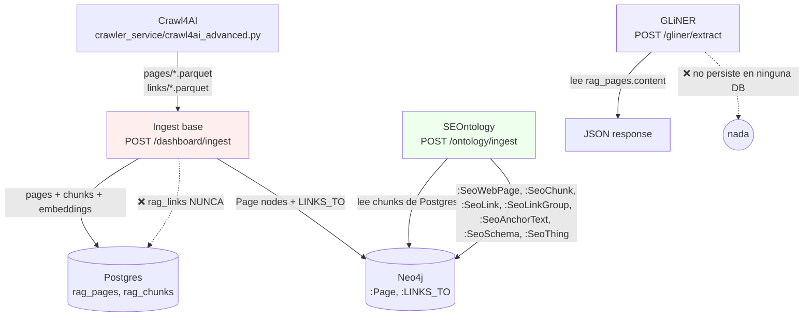

# INGESTION_PIPELINE.md — Auditoría end-to-end del pipeline de ingesta

> **Fecha:** 2026-04-08
> **Alcance:** flujo completo Crawl4AI → Ingest base → SEOntology → GLiNER
> **Método:** lectura directa del código (paths:línea citados). No suposiciones.
> **Estado de DBs al auditar:** vacías (re-ingesta pendiente tras separar stack UOC de Quiron).

---

## 1. Diagrama del flujo real

**Orquestador:** **no existe**. El usuario debe llamar los 3 endpoints manualmente, en orden.

---

## 2. Tabla de campos por etapa

### 2.1 Crawler → Parquet

Escrito por `crawler_service/crawl4ai_advanced.py` (y su gemelo en `scripts/`).

| Parquet | Columnas |
|---|---|
| `pages/crawl_date=*/pages_*.parquet` | `url`, `title`, `meta_description`, `markdown` (fit), `markdown_raw`, `html_content`, `content_hash`, `word_count`, `links_count` |
| `links/crawl_date=*/links_*.parquet` | `source_url`, `target_url`, `anchor_text`, `link_location` (`nav`/`footer`/`content`/`sidebar`), `link_weight` (0.3–1.0) |

> Lo que se pierde: las exclusiones CSS aplican al `fit_markdown`, no al `markdown_raw`. El `html_content` se preserva entero, lo que permite re-parseo posterior (lo aprovecha SEOntology).

### 2.2 Ingest base → Postgres + Neo4j

Función entry: `graph_rag/services/ingest_service.py:ingest_crawl_data()` (≈L56–379).

| Etapa | Postgres (`rag_*`) | Neo4j | Función |
|---|---|---|---|
| Pages | `rag_pages` (id, url, title, content, embedding, pagerank…) | `:Page` MERGE | `supabase.upsert_page()` ~L222 + `neo4j.upsert_page()` ~L283 |
| Chunks | `rag_chunks` (page_id FK, chunk_index, content, embedding) | **❌ nada** | `supabase.upsert_chunks_batch()` ~L275 |
| Links  | **❌ `rag_links` nunca se llama**  | `:LINKS_TO` (location, weight, anchor_text) | `neo4j.create_links_batch()` ~L330,339 |

Contadores devueltos al dashboard (~L367–379):
- `chunks_created = len(chunks_with_embeddings)` — número de chunks **enviados a Supabase**, no verificado en Neo4j (porque Neo4j no recibe chunks aquí).
- `links_migrated = len(links_batch)` — número de links **intentados** en Neo4j vía `create_links_batch()`. **Optimista**: cuenta intentos, no éxitos del MERGE.

### 2.3 SEOntology → enriquecimiento Neo4j

Entry: `graph_rag/services/ontology_service.py:run_seo_ingest()` (~L16–79) → `ontologia/ingest_ontology.py:SeoOntologyIngestor.ingest_from_parquet()` (~L92–139).

| Crea en Neo4j | Origen del dato |
|---|---|
| `:SeoWebPage` (label adicional sobre `:Page`) | parquet pages |
| `:SeoChunk` + `:HAS_CHUNK` desde `SeoWebPage` | **lee `rag_chunks` de Postgres** vía `_ingest_chunks_from_supabase()` (~L297–346), gated por flag `with_chunks=true` |
| `:SeoLinkGroup`, `:SeoLink`, `:SeoAnchorText` | parquet links (~L348+) |
| `:SeoSchema`, `:SeoThing` | extractores en `ontologia/extractors/` sobre `html_content` del parquet |

Endpoints API (`graph_rag/api/routes.py`):
- `POST /ontology/setup-schema` ~L2694 — constraints/índices
- `POST /ontology/ingest` ~L2663 — ingesta principal

### 2.4 GLiNER → entidades en memoria

Entry: `graph_rag/services/gliner_service.py:extract_entities()` (~L170–220).

- **Input:** `rag_pages.content` desde Supabase
- **Modelo:** GLiNER con `DEFAULT_LABELS` (22 etiquetas en español: persona, empresa, etc.)
- **Filtro:** dedup + score ≥ 0.6
- **Output:** **JSON en la respuesta HTTP** (`POST /gliner/extract` ~L2746). **No persiste en Neo4j ni Postgres.**

### 2.5 init_db.sql → tablas Postgres

`rag_clients`, `rag_pages`, `rag_chunks` (FK→pages), `rag_links` (FK→pages source/target), `rag_conversations`, `rag_messages`.

> `rag_links` existe en el schema pero el ingest **nunca la puebla**. Solo `migration_service.py` (legacy) la usa.

---

## 3. Orden de ejecución correcto

Inferido del código (no hay orquestador, todo manual):

1. **Crawler** → produce parquets (`POST /dashboard/crawler/start`)
2. **Ingest base** → `POST /dashboard/ingest` → puebla `rag_pages`, `rag_chunks`, `:Page`, `:LINKS_TO` + dispara PageRank (~L1711)
3. **Ontology setup** → `POST /ontology/setup-schema` (constraints SEO en Neo4j)
4. **Ontology ingest** → `POST /ontology/ingest` con `with_chunks=true` → añade labels SEO y `:SeoChunk` leyendo desde `rag_chunks`
5. **(Opcional) GLiNER** → `POST /gliner/extract` (sin efecto persistente)

**Dependencias duras:**
- (4) requiere (2) completado, porque lee `rag_chunks` de Postgres.
- (3) debe correrse al menos una vez antes de (4) en una DB nueva.
- Si (2) falla en escribir chunks a Postgres, (4) no encuentra nada que promover a `:SeoChunk`.

---

## 4. Gaps, duplicidades y bugs detectados

### 🔴 BUG-1 — `rag_links` jamás se puebla
**Evidencia:** `ingest_service.py` nunca invoca `supabase.upsert_links_batch()`. Solo `migration_service.py` (legacy) lo hace.
**Síntoma observado:** `rag_links` 100% vacío tras ingest exitoso.
**Decisión pendiente (P0 en STATUS):** o se elimina la tabla del schema, o se añade el upsert al ingest. Recomendación: **eliminar** — single source of truth = Neo4j.

### 🔴 BUG-2 — `links_migrated` es optimista
**Evidencia:** `neo4j_client.create_links_batch()` ~L154–170 hace `MATCH source:Page / MATCH target:Page` antes del MERGE. Si target apunta a host externo o URL no crawleada, el MATCH falla y no se crea relación. **No lanza excepción**. El contador del ingest cuenta intentos enviados, no resultados del MERGE.
**Síntoma observado:** dashboard reporta `links_migrated=96` pero `MATCH ()-[r:LINKS_TO]->() RETURN count(r)` puede dar 0 si las páginas target no existían en `:Page`.
**Fix sugerido:** devolver `count(r)` real desde la query Cypher y propagarlo al contador.

### 🔴 BUG-3 — Chunks reportados pero ausentes en Neo4j
**Evidencia:** `ingest_service.py` ~L275 escribe chunks **solo a Postgres**. Neo4j no recibe `:SeoChunk` durante el ingest base.
**Aclaración:** esto **no es un bug del ingest base** (el contrato es: Postgres tiene chunks, Neo4j tiene grafo de páginas). Lo que crea `:SeoChunk` en Neo4j es la **etapa SEOntology** (`_ingest_chunks_from_supabase()`).
**Síntoma del usuario** (`chunks_created=28` pero 0 `:SeoChunk` en Neo4j) se explica si:
- (a) nunca corrió el endpoint `/ontology/ingest` después del ingest base, **o**
- (b) lo corrió sin `with_chunks=true`, **o**
- (c) `_ingest_chunks_from_supabase()` falló silenciosamente.
**Acción:** verificar tras la próxima re-ingesta cuál de los tres es el caso real.

### 🟡 BUG-4 — GLiNER no persiste resultados
**Evidencia:** `gliner_service.py:extract_entities()` retorna JSON; ninguna escritura a DB.
**Impacto:** las entidades se pierden al cerrar la pestaña. No hay enlace al grafo (`:Page-[:MENTIONS]->:Entity` o similar).
**Decisión pendiente:** definir contrato — ¿`:SeoThing`? ¿label propio? ¿con qué relación a `:SeoChunk` o `:SeoWebPage`?

### 🟡 BUG-5 — Embeddings per-chunk (lento)
**Ya conocido** (STATUS P1). `embed_document` se llama por chunk en lugar de `embed_documents_batch`.

### 🟡 GAP-1 — No hay endpoint orquestador
El usuario debe encadenar 4 llamadas manuales. Riesgo alto de saltarse pasos (ej. olvidar `with_chunks=true`).
**Sugerencia:** `POST /dashboard/full-ingest` que invoque (2)→(3)→(4)→(5) en secuencia y devuelva un reporte unificado con counts **verificados** de cada DB.

### 🟡 GAP-2 — No hay verificación post-ingesta
Ningún endpoint compara "lo que dije que escribí" vs "lo que realmente hay en Neo4j/Postgres". Es la causa raíz del desencuentro reportado por el usuario.
**Sugerencia:** añadir `GET /dashboard/ingest/verify` que ejecute counts en ambas DBs y los compare con el último report.

---

## 5. Plan de consolidación priorizado

| Prioridad | Acción | Justificación |
|---|---|---|
| **P0** | Cambiar `links_migrated` para devolver `count(r)` real desde Cypher (BUG-2) | Sin esto, no podemos confiar en ningún número del ingest |
| **P0** | Añadir `GET /dashboard/ingest/verify` con counts reales en ambas DBs (GAP-2) | Imprescindible para diagnosticar futuros desencuentros |
| **P0** | Re-ingesta de prueba con UOC y verificar manualmente los 3 contadores contra Neo4j Browser | Confirma BUG-3 (a/b/c) |
| **P1** | Decidir destino de `rag_links` — borrar de schema o poblarlo (BUG-1) | Evita confusión "tabla existe pero vacía" |
| **P1** | Endpoint orquestador `/dashboard/full-ingest` (GAP-1) | Reduce errores operativos |
| **P1** | Batch embeddings (BUG-5) | Performance |
| **P2** | Definir contrato de persistencia para GLiNER (BUG-4) | Sprint 3 SEOntology lo absorberá |

---

## 6. Referencias de código

- Crawler: `crawler_service/crawl4ai_advanced.py`, `scripts/crawl4ai_advanced.py`
- Ingest base: `graph_rag/services/ingest_service.py:56–379`
- Neo4j client: `graph_rag/services/` (cliente Neo4j) — `create_links_batch()` ~L154–170
- SEOntology: `graph_rag/services/ontology_service.py:16–79`, `ontologia/ingest_ontology.py:92–139`, `_ingest_chunks_from_supabase()` ~L297–346
- GLiNER: `graph_rag/services/gliner_service.py:170–220`
- Endpoints: `graph_rag/api/routes.py` — ingest L1609, scores L1711, ontology L2663/L2694, gliner L2746
- Migration legacy (referencia): `graph_rag/services/migration_service.py:46–208`
- Schema Postgres: `init_db.sql`
